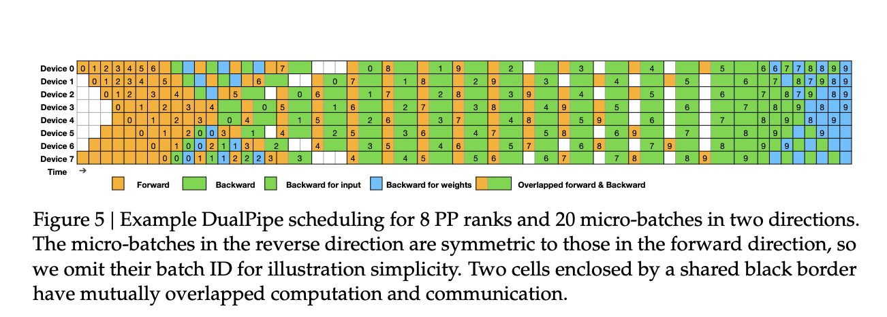

# The Sparsity Frontier: Advances in Kimi K2 and DeepSeek V3
(NOTE: UNDER CONSTRUCTION)

## 1. Introduction
A core design limitation of standard dense LLMs is the tight coupling between parameter count ("knowledge") and per-token FLOP count (the amount of "work" required to
generate a token), due to knowledge being *diffuse* across parameters rather than *localized* to
subsets of them. When we ask "what is the capital of Kenya?", we effectively pay for the LLM's
proficiency in literature, medieval history, and quantum mechanics, despite the bounded scope
of our question.

A natural solution to this problem is sparsity: selectively activate a
bounded subset of parameters for each token, thereby decoupling memory and
compute and implicitly localizing knowledge. Mixture of Experts
(MoE) layers are a form of structured sparsity, and are the standard approach used today. 

Despite its intuitive appeal, sparsity raises complex challenges. Sparsity imposes
discrete structural constraints on systems we train with continuous tools (backprop) on
distributed hardware originally built for dense matrix math, raising implications for both modeling (optimization dynamics, manifold geometry, post-training stability) and systems (increased communication, memory pressure, fragmentation).

In this article, we'll first frame these core challenges, and then explore how bleeding-edge sparse
models [DeepSeek V3](https://arxiv.org/abs/2412.19437) and
[Kimi K2](https://arxiv.org/abs/2507.20534) address them while advancing
the frontier of sparsity.

---

## 2. Preliminaries
### 2.1 Prerequisites
This is a technical article. We'll assume familiarity with the basics of what
[MoE layers](https://newsletter.maartengrootendorst.com/p/a-visual-guide-to-mixture-of-experts) are
and how [distributed training](https://colossalai.org/docs/concepts/paradigms_of_parallelism) works.

### 2.2 Scope & Roadmap
Kimi K2 and DeepSeek V3 introduce a number of innovations across data, pretraining, and 
post-training. We'll primarily focus on pretraining aspects directly connected to
MoEs and sparsity. In particular, we'll discuss:

* Challenges with training large sparse models, and frames for reasoning about them (Sections 3 and 4)
* Core elements of Kimi K2 and DeepSeek V3's sparsity architectures (Section 5)
* Several innovations in K2 and DV3 that address specific sparsity challenges (Sections 6-8)
* Some personal reflections (Section 9)

This article will mostly focus on systems innovations and systems-modeling codesign. We'll cover
a very interesting pure modeling piece (auxiliary-free load balancing in DeepSeek V3) in Part 2.

### 2.3 Notation
We consider MoE layers with input dimension $D$,
$m$ total experts, and $k$ selected experts (per token, per layer). We'll let $k_f$ denote the number of
shared/fixed experts ($m$ and $k$ refer only to non-shared), and $T$ the
context length. (See the spec table in Section 5.4 for a full list of symbols used across the article.) We'll use DV3 and K2 as shorthand for
DeepSeek V3 and Kimi K2. Key terms are highlighted in blue,
and key ideas in green; hence a good way to skim this article is to follow
the colored words.

---

## 3. Systems Challenges for Sparsity
### 3.1 High Level Framing
A general design goal in modern distributed training is to hide latency by scheduling compute
to overlap with communication; hence anything that increases communication or makes it less
predictable poses a challenge.

Sparsity lets FLOP count scale sublinearly with parameter count, but those parameters still need to
live somewhere. Total memory, and hence device count, scale roughly linearly with parameters.
Sparsity effectively shifts the burden from
compute to memory and
communication, with negative implications for
[arithmetic intensity](https://modal.com/gpu-glossary/perf/arithmetic-intensity) if not
mitigated. As we'll see, the resulting systems challenges are tightly coupled to architectural
choices, meaning model designers cannot simply abstract away infrastructure details. This creates a
rich surface area for infrastructure-architecture codesign. 

### 3.2 Dynamic Dispatch
Expert parallelism partitions the $m$ experts across $d$ devices. The
choice of which expert processes which token is a function of the token, so tokens must be
dynamically dispatched to experts. Mechanically, this involves packing tokens into contiguous per-destination send
buffers (with padding for alignment), exchanging via all-to-all dispatch,
processing as batched small GEMMs, and finally unpermuting to the original order with another all-to-all. Communication is
overlapped with computation via double buffering.

This communication pattern raises several potential issues, including imbalanced loads, fragmented
memory access, small kernels, and poor cache locality.

### 3.3 Intra-Node vs Inter-Node Communication
GPU training clusters are composed of nodes, each of which is a server
typically containing 8-16 GPUs. Within a node, GPUs communicate via
NVLink or NVSwitch, whereas communication across
nodes uses InfiniBand or RoCE. These have very
different bandwidths: NVLink offers ~1.8 TB/s bidirectional per GPU on Blackwell,
while InfiniBand (XDR 800) offers ~100 GB/s per port, typically aggregated over 2-8 ports per
node. The implication for model designers is that communication costs are heterogeneous. This motivates thinking of experts not just in isolation, but
potentially defining topology-aware groupings of experts based on physical
colocation. We'll see dispersion bounding (Section 5.1) and
hot expert replication (Section 6.3) as concrete instances of this idea.

### 3.4 Memory Pressure
In MoE layers, gradients don't flow to non-selected experts, so at first glance, it should seem that
like compute, the amount of state we need to persist for the backward pass (besides weights
themselves) scales with $k$, not $m$. A few issues complicate this picture. 

Routing Metadata 
Routing necessitates a lot of bookkeeping: top-k indices, permutation maps, and scatter/gather
layouts to invert token dispatch for the backward pass, plus auxiliary terms for load balancing.
This is still $O(kT)$ per layer, but nontrivial overhead nonetheless. 

Comms Buffers 
Padding in send/recv buffers becomes significant under imbalanced loads and small per-expert
batches, especially early in training; double buffering increases the peak footprint.

Optimizer State 
Algorithms like Muon and Adam require per-parameter additional state, which grows with $m$ rather
than $k$, and is typically FP32 even if weights are reduced precision. The K2 paper notes, "*after
reserving space for parameters, gradient buffers, and optimizer states, the remaining \[HBM\] is
insufficient to hold the full MoE activations.*"

Load Imbalance 
In addition to *total* memory, load imbalances can tip high-load GPUs over their individual limits, causing OOM crashes.

We'll see in Sections 5-8 how K2 and DV3 address systems challenges via various
techniques including dispersion bounding, novel pipeline schedules, replication, caching, reduced
precision, activation recomputation, CPU offloading, and others.

---

## 4. Discrete Routing & Expert Specialization: A Thought Experiment
Like attention heads, we can think of individual experts as
[low-rank readers and writers](https://pranavsriram18.github.io/genai_foundations/series/transformer_internals/#6-attention-heads) from/to the residual stream. Unlike attention though, we
only activate a sparse subset of these readers and writers for a given input. Intuitively, a
modeling design goal of MoE layers is for different experts to specialize to "cover" different parts
of the input data manifold. A few potential failure modes include:

* Under-specialization (several experts learning the same thing) 
* "Dead experts" (some experts never getting selected by the router)
* Load imbalance (some experts activating far more frequently than others)

Below we describe a thought experiment for thinking about how these problems can arise under vanilla
top-k routing (without interventions like load balancing regularizers, capacity limits, etc.), and
hence motivate those interventions. 

Imagine we have several lakes (regions of the data manifold), each with varying number of fish (data
samples). We need to allocate fishermen (experts) to these lakes, under competing constraints.

To start, say we have just 2 lakes, with 10 and 4 fish respectively, and 2 fishermen. Allocating
both fishermen to the lake with 10 fish is globally suboptimal (10 fish caught vs 14), but locally
optimal for each fisherman (5 fish each vs 4 if they switch), with no incentive (gradient) to
switch to the uncovered lake. A third fisherman, who starts in a barren lake with no fish (bad
expert initialization), starves (zero gradient from hard top-k gating) rather than switching to the untapped second lake. A fourth,
who discovers a populated lake with 100 fish, becomes disproportionately wealthy (load imbalance),
without any redistributive mechanism (discrete routing creating a "rich get richer"
phenomenon).

These issues make training MoEs tricky, necessitating careful
auxiliary losses/regularizers to ensure proper specialization and load balancing, plus monitoring during
training to detect and revive dead experts. We'll explore these issues in more depth in Part 2,
where we'll also see how DV3 was able to dispense with (most) auxiliary losses via a novel
algorithm with interesting geometric and control-theoretic interpretations.

---

## 5. Sparsity Architecture
In this section we'll examine the broad contours of the architectures of K2 and DV3.

### 5.1 Expert Selection
The high-level elements of K2 and DV3's MoE layer are fairly familiar: for each token, first compute
token-expert affinities with a per-expert sigmoid, then apply top-k hard gating, and finally normalize
selected experts' affinities into scores. Both K2 and DV3 use one shared
expert that is exempt from this scoring process (its score is fixed to 1). 

DV3 introduces two core twists: auxiliary-free load balancing via a bias
term (discussed in Part 2) and dispersion bounding.

Dispersion Bounding (DV3) 
Dispersion bounding reduces inter-node communication by explicitly capping how many nodes a single token may
touch in an MoE layer. Ordinary MoE routing simply selects the experts with the top $k$ scores. DV3
constrains this selection so that the selected experts reside in at most 4
nodes. Concretely, say we have 8 active experts. Say the top 7 scoring experts live on nodes
$n_1, n_2, n_3, n_4$, while the 8th expert lives on a fifth node $n_5$. The 8th expert would be
dropped and replaced by the next-highest scoring expert that lives on one of $n_1, n_2, n_3, n_4$.

### 5.2 Ultra Sparse Design
DV3 uses $k = 8$, $m = 256$, $k_f = 1$ (8 active out of 256, 1 fixed), for a sparsity
ratio of $s = 32$. K2 pushes further, with $k = 8$, $m = 384$. This is not only a high ratio, but
also very fine-grained sparsity. The table below compares these
models to some of their contemporaries whose specs are public. 

| Model | Year | $m$ (Total Experts) | $k$ (Active Experts) | $s$ (Expert Sparsity) | $P$ (Total Params) | $P_a$ (Active Params) |
| --- | ---: | ---: | ---: | ---: | ---: | ---: |
| Kimi K2 | 2025 | 384 | 8 | 48.0 | **1.04T** | **32.6B** |
| DeepSeek V3 | 2024 | 256 | 8 | 32.0 | **671B** | **37B** |
| Qwen3-235B | 2025 | 128 | 8 | 16.0 | **235B** | **22B** |
| GPT-OSS-120B | 2025 | 128 | 4 | 32.0 | **117B** | **5.1B** |
| DeepSeek V2 | 2024 | 160 | 6 | 26.7 | **236B** | **21B** |
| Switch-C | 2021 | 2048 | 1 | 2048.0 | **1.57T** | **13B** |
| OLMoE | 2024 | 64 | 8 | 8.0 | **7.0B** | **1.3B** |
| DBRX | 2024 | 16 | 4 | 4.0 | **132B** | **36B** |
| Grok-1 | 2024 | 8 | 2 | 4.0 | **314B** | **~86B** |
| Mixtral 8x22B | 2024 | 8 | 2 | 4.0 | **141B** | **~39B** |
| Llama 3.1 405B | 2024 | 1 | 1 | 1.0 | **405B** | **405B** |

K2 and DV3 push sparsity further than their contemporaries, with one notable exception - Google's
Switch Transformer is an outlier along every dimension in this table, and
was in many
ways ahead of its time. My sense is that the representational weaknesses of the $k=1$ design tend to
outweigh the its systems benefits, leading most modern MoEs to use $k \in [2, 8]$. I wouldn't
be surprised if future models actually raise $k$, and push $s$ by
raising $m$ and decreasing expert width $b$, i.e. pursuing finer-grained sparsity rather than just 
fewer active experts. We'll defer a deeper discussion of the representational implications of this
to a future article.

### 5.3 Sparsity Scaling Laws
The K2 paper develops an empirical Sparsity Scaling Law, in which they
observe:

"*Under a fixed number of activated parameters (i.e., constant FLOPs) — increasing the total number
of experts \[...\] consistently lowers both the training and validation loss \[...\]. Concretely,
under the compute-optimal sparsity scaling law, achieving the same validation loss of 1.5, sparsity
48 reduces FLOPs by 1.69x, 1.39x, and 1.15x compared to sparsity levels 8, 16, and 32,
respectively. Though increasing sparsity leads to better performance, this gain comes with increased infrastructure complexity.*"

These empirical findings corroborate our intuition that sparsity makes sense
computationally, and that the primary bottlenecks come from today's infrastructure. With
novel hardware and algorithms, might we see models with 1000x or 10000x sparsity in the
not-so-distant future?

### 5.4 Spec Table
The table below summarizes several key aspects of DV3 and K2's architectures. We'll discuss many
of these in subsequent sections.

| Dimension | DeepSeek V3 | Kimi K2 |
| --- | --- | --- |
| **$P$ (Total Model Params)** | **671B** | **1.04T** |
| **$P_a$ (Active Model Params)** | **37B** | **32.6B** |
| **Total:Active Param Ratio** | **18.3** | **31.9** |
| **Pretraining Tokens** | **14.8T** | **15.5T** |
| **$L$ (Total Layers)** | **61** | **61** |
| **$D$ (Embedding Dimension)** | **7168** | **7168** |
| **$T$ (Context Length)**  | **128K**  | **128K** |
| **$m$ (Total Experts)** | **256** | **384** |
| **$k$ (Active Experts)** | **8** | **8** |
| **$s$ (Expert Sparsity)** | **32** | **48** |
| **$k_f$ (Shared Experts)**| **1** | **1** |
| **$b$ (Expert width)** | **2048** | **2048** |
| **Learning Algorithm** | **AdamW** | **MuonClip** |
| **Routing Control** | **Aux-loss-free dynamic bias** + lightweight **sequence-level** safeguard | **Simple top-k** (no grouping, no in-gate balancing) + **standard aux losses** |
| **Dispersion Control** | **Node-limited ($\leq 4$ nodes/token)** | **None explicit; implicit via low EP** |
| **Attention Mechanism** | **MLA** | **MLA** |
| **Attention Heads**  | **128** | **64** |
| **Parallelism Strategy** | **DualPipe** | **Interleaved 1F1B** |
| **Memory Optimizations** | **Recompute**, **Reduced Precision**, **CPU Offload** | **Recompute**, **Reduced Precision**, **CPU Offload** |

---

## 6. Communication Optimizations
### 6.1 Forms of Parallelism
Both models compose pipeline parallelism (PP), expert
parallelism (EP), and [ZeRO-1 data parallelism (DP)](https://awsdocs-neuron.readthedocs-hosted.com/en/latest/frameworks/torch/torch-neuronx/tutorials/training/zero1_gpt2.html).

As we saw in Section 3, cross-node communication under expert parallelism unfavorably tips the
balance of communication and computation. A natural step to counteract this, particularly with
fine-grained sparsity, is to remove tensor parallelism. The DV3 paper
explicitly mentions removing tensor parallelism during training, and the K2 paper doesn't mention
using tensor parallelism.

### 6.2 Pipeline Schedules
DualPipe (DV3) 
DV3 introduces a novel pipeline schedule called DualPipe, whose core idea is to carefully
overlap communication and computation
within a paired forward-backward channel. Specifically, DualPipe splits
each layer into substages:

* Forward: attention, dispatch, MLP, combine 
* Backward: same, but attention and MLP further split into `dInput` and `dWeight`

Each stage maintains two in-flight parameter/gradient copies so a forward and a
backward channel can run concurrently without blocking on the same weights. With careful reordering,
DualPipe overlaps nearly all communication (MoE + pipeline) with compute, as illustrated in the
figure below from the DV3 paper. Note that this comes at the cost of increased memory footprint due to the replication.

Interleaved 1F1B (K2) 
K2's authors cite DualPipe’s extra parameter and gradient memory footprint as prohibitive for
scaling to a trillion parameters, and stick to
[interleaved 1F1B](https://colossalai.org/docs/features/pipeline_parallel/), an existing method
in which each stage alternates one forward and one backward microbatch. Unlike DualPipe, 1F1B does
not require an extra copy of parameters.

Since K2 uses only 64 attention heads (compared to 128 in DV3), there is an increased need to
reduce expert communication in order for it not to dominate during 1F1B. K2 achieves this
by adopting "*the smallest feasible EP parallelization strategy,*" partitioning experts across just
16 devices. Note that lower EP implies more experts
per GPU, which implicitly smooths load (even under *expert* imbalance, there's a higher
likelihood of *GPU* balance, due to the law of large numbers).

### 6.3 Inference: Hot Expert Replication (DV3)
The basic idea of replication is that during inference, we can monitor online statistics of expert
loads, and redundantly deploy high-load experts in a manner that balances
load across GPUs without increasing inter-node communication. DV3 applies this strategy to the
prefilling stage of inference specifically. It uses 32 redundant experts (out of $m=256$ total),
with each GPU hosting its 8 original experts plus 1 redundant expert.

### 6.4 Custom Kernels
DV3 develops custom kernels using [PTX](https://developer.nvidia.com/blog/understanding-ptx-the-assembly-language-of-cuda-gpu-computing/) for efficient all-to-all communication. While
specifics of this kernel are beyond the scope of this article, what stands out is the
extent of codesign: the routing mechanism (dispersion bounding), cluster
topology, pipeline schedule (DualPipe), and custom kernels are all jointly optimized.

---

## 7. Memory Optimizations
### 7.1 Activation Recomputation
Activation recomputation is a standard idea in pretraining, wherein certain activation-heavy 
layers are recomputed during the backward pass rather than persisting
their activations, effectively trading some compute overhead for large memory savings. This is
particularly valuable for MoEs, because they have a high
memory-to-compute ratio by design, and because they are vulnerable to OOMs under load imbalance.

K2 uses aggressive activation recomputation, applying it to LayerNorm, SwiGLU, MLA up-projections,
and MoE down-projections. DV3 applies activation recomputation to RMSNorm and MLA up-projections. 

### 7.2 CPU Offloading
The basic idea of CPU offloading is to identify pieces of state that can be computed on GPUs then
transferred to CPU RAM, or computed entirely on CPUs.

For activations that are not recomputed, K2 offloads them to CPU RAM, using a custom
streaming copy engine that overlaps with both compute and communication kernels in the 1F1B schedule.

DV3 maintains an exponential moving average (EMA) of model parameters during training. This is
stored in CPU memory, and updated asynchronously.

### 7.3 Reduced Precision & KV Cache Reduction
Both DV3 and K2 make extensive use of reduced precision for both activations and optimizer states.
Reduced precision is a large topic in its own right, and we'll leave a detailed treatment to a
future article. Both models use Multi-Head Latent Attention (MLA), discussed briefly in the next section.

---

## 8. Non-MoE Techniques
Before we conclude, we briefly highlight a few other significant architectural innovations in K2 and DV3 that, while not directly tied to MoEs, still strongly influence overall efficiency.

Multi-Token Prediction (DV3) 
DV3 trains the model to predict the next two tokens simultaneously, as opposed to single next token
prediction. During inference, this prediction can be used for speculative decoding, enabling a
~1.8x TPS speedup in practice.

MLA (DV3 and K2) 
Both DV3 and K2 use Multi-head Latent Attention, a novel attention
mechanism introduced by DV3. MLA factors attention through a lower-dimensional latent and caches
this latent during inference, thereby reducing activation memory during training and cutting KV cache footprint during inference. Unlike many efficient attention mechanisms, MLA does not appear to cause accuracy degradations or long context weaknesses. We may examine MLA further in future articles on dynamic sparse attention mechanisms.

MuonClip (K2) 
K2’s training stability hinges on MuonClip, which augments the
[Muon](https://jeremybernste.in/writing/deriving-muon) algorithm with a QK-clip to prevent exploding attention logits. The paper reports 15.5T
tokens of pretraining without loss spikes.

## 9. Reflections
I started this article intending to write a short note on a few key ideas related to scaling
fine-grained sparsity. As I dove into the DV3 and K2 papers, the level of detail and innovation
was quite striking - several pages later, it still feels like I've barely scratched the surface! I
even had to defer some topics originally intended for this piece to a separate Part 2.

I was particularly struck by the extent of model-infra codesign. I've long felt the
researcher-engineer dichotomy is contrived, and that progress in AI will come from teams that
deeply understand both abstract ideas and the physical systems that implement them.

I've been interested in sparsity as a theme since I first read about compressed sensing as a
freshman in 2014. For many years, sparsity has remained something of an afterthought in ML, largely
due to the challenges of getting it to work efficiently on hardware originally built for dense
matrix math. It's great to see sparsity become a mainstay in SOTA deep learning models, and
I'm excited to see what the future of sparsity research holds.
