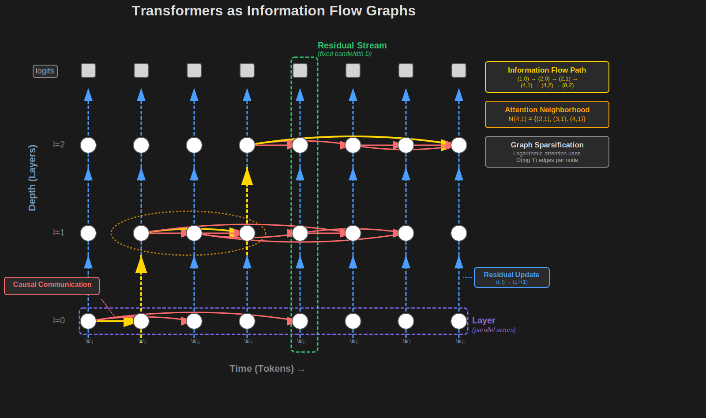

# Understanding Transformer Internals: An Information Flow Graph Lens

## 1. Introduction

How do Transformers - the models that underpin modern LLMs - actually work under the hood? And how
can we make them faster? These are central questions in modern AI research, particularly in the
subfields of mechanistic interpretability, attention variant design, and sparsity. The goal of this
article is to bridge the gulf between introductory material and the rapidly evolving frontier of
these fields, and deepen readers' intuition on Transformer internals and attention variants.

In particular, our (perhaps ambitious) thesis is: despite the diversity of
ideas in this space, a handful of mental models
and metaphors is sufficient to understand the research frontier.

To this end, we hope to explore the following ideas in this and future articles. (If some of these
terms are unfamiliar, that's expected - we'll develop each from first principles.)

* Transformer models as defining information flow through a grid graph
* Residual Streams as fixed-bandwidth information highways
* Transformer Layers as a sequence of collaborating actors with immediate and long-term goals
* Ordinary Attention as a particular implementation of an abstract interface for cross-stream
  causal communication
* QK and OV circuits as determinants of where and what information flows respectively
* Attention Heads as low-rank, additive updates that write into subspaces of the
  residual stream
* Several attention variants as  *connectivity-preserving static or dynamic
  sparsification* of the underlying information flow graph
* Kernelized Attention as defining a *factor graph* mediating cross-stream communication

---

## 2. Prerequisites and Notes on Style

**Prerequisites**

This article assumes you're comfortable with the basics of the transformer architecture,
particularly causal self-attention. We recommend [Andrej Karpathy's video](https://www.youtube.com/watch?v=kCc8FmEb1nY), [3Blue1Brown's video](https://www.youtube.com/watch?v=wjZofJX0v4M), and [The Illustrated Transformer](https://jalammar.github.io/illustrated-transformer/) as excellent starting points.

**Scope**

We focus exclusively on causal, decoder-only transformers (like GPT-style models). Throughout this article, "attention" or "ordinary attention" refers to the standard causal self-attention mechanism used in these models, whereas attention variants
will use additional qualifiers (e.g. "sliding window attention").

**Inspiration**

This article is heavily inspired by Anthropic's [Mathematical Framework for
Transformer Circuits](https://transformer-circuits.pub/2021/framework/index.html). One of our goals
is to provide a gentler onramp to some of the deep technical insights expounded in that work.

**Caveats**

Our emphasis is on building intuition rather than mathematical rigor or implementation details. To this end, we take the following liberties:

* Omit architectural and implementation details that don't change the core story (like normalizers, regularizers, numerical issues, positional encoding subtleties, special tokens, etc.)
* Liberally anthropomorphize (introducing "actors" that "want" information, etc.)
* Depict parallel computations as serial when it aids understanding.

**Notation**

We'll use the following notation throughout. Our working model will be a causal, decoder-only
transformer with $L$ layers, hidden dimension $D$, and context length $T$. We denote input tokens
by $w_1, \ldots, w_T$, and use $x_{t,l}$ to denote the representation of token $t$ at the input to
layer $l$. We use 1-indexing for tokens and 0-indexing for layers; $x_{t,0}$ denotes the
representation of the $t$th token entering the layer 0 (i.e. after token embedding and positional embedding).
Key terms are highlighted in blue and key insights in green. 
(Hence, a good way to skim this article is to simply follow the colored words.)
---

## 3. The Transformer as a Grid of Information Flow

### 3.1 Introducing the Grid View
Our core frame will be to view transformers in terms of information flowing through a grid. The
two axes of this grid are time (tokens) and depth (layers). Each node $(t, l)$ on the grid
represents the state of token $t$ at the start of layer $l$, which we denote $x_{t,l}$.

**Rows as Layers**

A horizontal row in our grid corresponds to a transformer layer. Layers are the computational units
we typically think about in deep learning: a model is a composition of several layers. Each
transformer layer is composed of three core operations:

1. Attention - the core focus of this article.
2. MLP - a shallow feedforward neural network.
3. Normalizers and regularizers, like LayerNorm, dropout, and others. While important, we will omit
these from all equations and descriptions for brevity, as they don't change our core explanations.

**Columns as Residual Streams**

A vertical column corresponds to a single token being processed across layers. We call the $t$-th
column the residual stream for token $t$, a term popularized in Anthropic's
original [Transformer Circuits paper](https://transformer-circuits.pub/2021/framework/index.html).
The diagram above depicts the residual stream for the third token, and how information can move
forward from previous streams into this stream via causal attention.

A key frame we'll adopt is a shift from thinking about transformers as stacks of rows (layers),
and instead as a series of parallel columns, i.e. residual streams. These
residual streams are persistent information channels carrying token representations upwards
through the model.

### 3.2 The Journey of a Single Token

Given a sequence of input tokens $w_1, \ldots, w_T$, focus on how a single token $w_t$ flows through
its residual stream. 

1. The token enters its stream as the sum of its word **embedding vector** $e_t$ and
   **positional embedding** $p_t$. 

2. Each layer computes an update that is added to the stream - hence the term
   residual. The token's representation evolves through a sequence of intermediate states
   $x_{t,0}, x_{t,1}, \ldots, x_{t,L}$.

3. At the final layer, the representation is multiplied by the unembedding matrix to produce logits
   over the vocabulary, which are then normalized into a probability distribution for the next token.

We can thus think of the residual stream as an information highway, in which the current
token evolves through a progressive sequence of representations that culminate in a [sufficient statistic](https://www.youtube.com/watch?v=5j4E2FRR384) for
 the distribution of the next token. Importantly, this highway has a fixed bandwidth, dictated by
 the dimensionality $D$ of the residual stream state. 

### 3.3 Residual Actors and Attention as an Interface

Let's start to unpack what happens inside a layer. A metaphor we'll introduce is to imagine an "actor"
associated with each residual stream within a layer, which we'll call a "residual actor." We'll
imagine each actor as responsible for implementing the layer update for its stream.

We can frame the two core operations within a layer as follows:

* Attention as communication - specifically, actors pulling information from previous actors.

* MLP as solo computation - actors individually performing computation on their own post-attention state.

$$
\begin{aligned}
&\text{# Attention: collaboration step, pull from previous actors} \\
&z_{t,l} = x_{t,l} + \mathrm{Attend}(x_{1,l}, \ldots, x_{t,l}) \\[1em]
&\text{# MLP: solo step, compute locally} \\
&x_{t,l+1} = z_{t,l} + \mathrm{MLP}(z_{t,l})
\end{aligned}
$$

With this framing, a single layer is implemented by multiple collaborating actors,
using attention as the interface for communication.

### 3.4 Collaborating Actors and Goals
Continuing with the actor metaphor, we ask: what are the goals of each actor? Well, at the end of
the $t$-th residual stream, the model needs to predict the $t+1$-th token $w_{t+1}$. So, the
immediate goal of actor $t$ is to evolve the representation $x_{t, l}$ towards a representation predictive of the next token. But because future actors can also read from actor $t$,
it also has a secondary goal: compute information useful for those future actors.

This framing provides a first-principles view of how models trained for next-token prediction can
actually plan ahead, a phenomenon verified empirically in [work by Anthropic](https://www.anthropic.com/research/tracing-thoughts-language-model).

### 3.5 The grid as a graph

Tying this all together, we can complete our framing of transformers as a graph.

* Vertical edges $(t, l) \to (t, l+1)$ represent the
evolution of a token's representation via residual updates between layers.

* Horizontal edges $(u, l) \to (t, l)$ represent information flow from
earlier to later streams.

(Note: technically there is also an edge from each node to itself. We omit these from diagrams and
from wording like "earlier to later" for brevity.)

In this view, a transformer is a two-dimensional graph of collaborating actors,
passing information forward in time through attention, and upwards in depth through residual updates.

---

## 4. Anatomy of Causal Attention
We'll now briefly recap ordinary attention, before highlighting aspects particularly salient to the
frames we're developing.

### 4.1 Revisiting Ordinary Attention
To motivate attention from first principles, let's put ourselves in the shoes of a single residual
actor at $(t, l)$. Our job in the attention step is to enrich our own state with information from
previous streams. We can break this task down into asking two fundamental questions:

*Where should we look?* Among all nodes $u \le t$, which ones are relevant
to me?

*What information should I grab?* From each chosen source, what information should I
import?

The "where" question can be answered by having each actor $(u, l)$ specify what kind of information
it has (key $k_{u,l}$), and what kind it wants (query $q_{u,l}$). Relevance is then
a function of what we're looking for (our query $q_{t,l}$) and what previous actors' have to offer (their key $k_{u, l}$).

The actual information we import is a weighted sum of previous actors' information payload
(value vector $v_{u,l}$), weighted by the relevance scores, and multiplied
by an output projection matrix $W_O$.

In pseudocode:

$$
\begin{aligned}
&\text{# score each key by dotting with the query} \\
&\text{for } u \text{ in range}(1, t{+}1)\text{:} \\
&\quad \mathrm{score}_{t,u} = q_t^{\mathrm{T}} k_u \\[6pt]
&\text{# normalize via softmax} \\
&\text{for } u \text{ in range}(1, t{+}1)\text{:} \\
&\quad a_{t,u} = \exp(\mathrm{score}_{t,u}) \big/ \sum_{j \le t} \exp(\mathrm{score}_{t,j}) \\[6pt]
&\text{# weighted average of values} \\
&h_t = \sum_{u \le t} a_{t,u} \cdot v_u \\[6pt]
&\text{# project and add to residual stream} \\
&z_{t,l} = x_{t,l} + W_O h_t
\end{aligned}
$$

### 4.2 Interpretability Takeaways: QK and OV Circuits
To unpack attention through the graph lens, we augment our previous grid graph with additional
nodes for query, key, and value vectors, as well as the residual updates. Below are some salient
aspects of the resulting picture.

Separation of Concerns: Queries and keys decide where
to read; values and $W_O$ determine what to write. These circuits
decompose information flow into edge-disjoint subgraphs called
QK and OV circuits, as depicted in the figure above.

Linearity Modulo Attention Pattern: the only source of nonlinearity comes
from the softmax operation, which is part of the QK circuit (determining the attention pattern). If
we fix the attention pattern, the entire attention operation becomes a linear function of its 
inputs. Freezing attention patterns thus allows interpreting OV circuits formed by stacking
attention layers (without MLPs), a lens adopted extensively in Anthropic's circuits paper.

Additive Integration: the imported content is added to the residual state;
nothing is overwritten outright. We'll see implications of this in Section 6.2.

Understanding these properties of attention is essential for understanding more complex circuits
composed of multiple attention layers. 

## 5. Computational Complexity of Attention
### 5.1 Complexity Derivation
Consider generating a sequence of $T$ tokens. The actor at node $t$ must compute attention over all
nodes $u \le t$, which involves:

* Computing query, key, and value given residual stream state: $\mathcal{O}(D^2)$ (matrix-vector multiplication with $D \times D$ weight matrices)
* Computing $t$ dot products between query and keys: $\mathcal{O}(tD)$  
* Weighted sum of $t$ value vectors: $\mathcal{O}(tD)$

So the actor at node $t$ does $\mathcal{O}(D^2 + tD)$ work. Summing across nodes, the total work is:

$$
\begin{aligned}
&\sum_{t=1}^T \mathcal{O}(D^2 + tD) \\
&\quad = \mathcal{O}(TD^2) + \mathcal{O}\left(D \sum_{t=1}^T t\right) \\
&\quad = \mathcal{O}(TD^2) + \mathcal{O}(T^2D) \\
&\quad = \mathcal{O}(T^2D) \quad \text{for } T > D.
\end{aligned}
$$

Intuitively, this quadratic scaling in $T$ makes sense: each residual actor does work proportional
to its index in the sequence, a typical hallmark of quadratic algorithms.

As a first approximation, the $\mathcal{O}(T^2D)$ complexity is the central bottleneck in scaling
transformers to long contexts, and much of the attention variant literature aims to attack this
term. (We'll discuss some nuances to this picture shortly.)

An important observation is that both the QK and OV circuits contribute to this quadratic cost:
each stream’s linear work stems both scoring all previous keys (QK circuit) and summing
all corresponding values (OV circuit). Thus, any attempt to break the quadratic
barrier must address both QK and OV circuits. 

### 5.2 Aside: Nuances on Complexity

Interestingly, in a [talk](https://www.youtube.com/watch?v=rBCqOTEfxvg&t=1080s) shortly after the original
Transformer paper, Łukasz Kaiser recalled being nervous about the cost being quadratic in context
length, before Noam Shazeer pointed out that $D$ was significantly larger than $T$. Their application was language translation of sentences, so T was just
~70 in their context! It's striking to hear because in under a decade we've gone from translating sentences to pushing models to reason over corpora of millions of tokens!

Another important detail when discussing complexity is that attention is highly parallel, so
wall-clock time and raw FLOP counts are two different things. An interesting frame in a world of
increasing compute is: what is the complexity of an algorithm in the limit of infinite parallel
compute? For a fascinating deep dive, see ["Attention is Logarithmic (Actually)"](https://supaiku.com/attention-is-logarithmic).

Finally, as a personal aside, a pet peeve of mine is when the complexity of attention is written as
$\mathcal{O}(T^2)$, silently treating the embedding dimension as a constant. This is problematic for
two reasons. First, the embedding dimension is not exactly a small constant - it's in the thousands
for frontier models. Second, an attention algorithm that actually addressed the $D$ term and
reduced complexity to say, $\mathcal{O}(T^2 \log D)$, could still represent a meaningful advance
despite still being quadratic in $T$.

---

## 6. Attention Heads
### 6.1 Work-Partitioning vs. Low-Rank Updates
The standard framing of multi-head attention is about work-partitioning:
keys, queries, and values are sliced along the embedding dimension, heads perform attention
independently on their slices, the results are concatenated and then projected using $W_O$ before
being added to the residual stream.

Let $h_t^1, h_t^2, \ldots, h_t^H$ denote the outputs from each of $H$ heads. In pseudocode:

$$
\begin{aligned}
&\text{# concat-then-project formulation} \\
&h_t = \mathrm{concat}(h_t^1, \ldots, h_t^H) \quad \text{# concatenate head outputs} \\
&z_{t,l} = x_{t,l} + W_O h_t \quad \text{# project and add to residual stream}
\end{aligned}
$$

A key linear-algebraic observation is: concatenation followed by linear projection
is equivalent to summing linear projections applied to the individual slices. Let $W_O^j$ be
the slice of $W_O$ corresponding to head $j$.

$$
\begin{aligned}
&\text{# equivalent independent-adds formulation} \\
&z_{t,l} = x_{t,l} + \sum_j \left(W_O^j\, h_t^j\right)
\end{aligned}
$$

With the latter formulation, we see that each head writes independently and
additively into the residual stream through its own projection slice $W_O^j$.

### 6.2 Implications for Mechanistic Interpretability
The dual framing of multi-head attention has a few key consequences:

Head specialization and circuits: the work partitioning frame shows how
different heads can specialize to "look for different things,"
composing into sophisticated circuits. [Induction heads](https://transformer-circuits.pub/2022/in-context-learning-and-induction-heads/index.html) are a beautiful example of
head composition across layers in action.

Low-rank, subspace-targeted writes: a head can only modify the residual 
within the column space of $W_O^j$, which has rank at most $D/H$. Heads are hence low-rank writers 
into subspaces of the shared stream.

Potentially limited interaction between heads: if two heads write largely
into orthogonal subspaces, later computation may treat their contributions as independent. Overlap
enables constructive or destructive interference. The geometry of $W_O$ therefore partitions
bandwidth and mediates the extent to which separate heads interact.

Implicit memory management: updates are additive and persistent.
Information written by a head persists unless future layers actively overwrite or counter-write it.
Since bandwidth is finite (dimension $D$), writing one thing necessarily crowds others. Research by
Anthropic has found empirically that some heads perform a sort of "memory management" role, actively
"deleting previous writes" that are no longer needed.

---

## 7. The Combinatorics of Transformers' Information Flows

Coming back to the information flow graph, we now ask an interesting question: in how many ways
can information propagate across a context window? More precisely, how many paths are there from
a node in the first stream $(1, l_1)$ to a node in the final stream $(T, l_2)$?

Recall that information moves through the graph by alternating between two types of edges:

Horizontal moves (attention): $(u, l) \to (t, l)$ where $u < t$

Vertical moves (residual): $(t, l) \to (t, l+1)$

Let's look at a simple case, where the nodes are separated by a single layer. That is, how many
paths are there from $(1, l)$ to $(T, l+1)$?

There are three categories of paths in this case: 

* All the way right, then up: $(1, l) \to (T, l) \to (T, l+1)$
* Up, then all the way right: $(1, l) \to (1, l+1) \to (T, l+1)$
* Part way right, up, rest of the way right: $(1, l) \to (k, l) \to (k, l+1) \to (T, l+1)$

In the third case, there are $T-2$ choices for $k$ (namely $k = 2, 3, \ldots, T-1$), for a total of
$T$ paths across all three cases. So even in a single layer network, there are already multiple
paths from the first token to the final stream.

More generally, any path from $(t, l)$ to $(t + p, l + q)$ requires $q$ vertical moves and a total
horizontal displacement of $p$. The number of ways to arrange these moves is the binomial
coefficient $\binom{p+q}{p}$. By [Stirling's approximation](https://en.wikipedia.org/wiki/Stirling%27s_approximation),
this grows exponentially with $min(p, q)$. Hence, as we scale context length and depth,
the number of information pathways quickly becomes astronomical. 

This combinatorial explosion suggests possible redundancy. We need information to be able to flow
across the context window, but with so many paths available, could we get away with removing some
edges? This intuition forms the basis for an entire family of efficient attention mechanisms that
we'll now explore in detail.

---

## 8. Static Graph Sparsification

Let's briefly review what we've established so far.

We've framed Transformers as defining information flow through a grid graph, where attention edges
enable communication between streams. In Section 7, we observed that the number of paths in this
graph from an input token to another node grows exponentially, prompting the following question: 
can we prune most edges while still maintaining good connectivity - that
is, ensuring information can still flow from across a context window within reasonable depth?

This section explores exactly this idea. We'll start by introducing some terminology to make these
notions precise, and then show how the frame of static graph sparsification 
unifies several efficient attention variants.

### 8.1 Terminology
**Neighborhoods**

Define $N(t, l)$ as the attention neighborhood of node $(t, l)$: that is,
the set of nodes that the actor at $(t, l)$ can attend to. In ordinary attention, we have
$N(t, l) = \{ (1, l), (2, l), \ldots, (t, l) \}$, i.e. all previous nodes in the current layer.

We'll see that a large number of efficient attention mechanisms boil down to simply defining $N(t, l)$
in different ways. In particular, these mechanisms shrink the neighborhood
to some subset of the full ordinary neighborhood. Why does this help? 

Observation: if we fix neighborhood size to some constant $w$, the time
complexity of generating $T$ tokens is $\mathcal{O}(TD^2 + TDw) = \mathcal{O}(TDw)$, assuming
the second term still dominates. This is a factor of $T/w$ saving over ordinary attention.

The reasoning mirrors that in Section 5: both the query-key scoring and value-aggregation steps now
cost $\mathcal{O}(wD)$ per token instead of $\mathcal{O}(tD)$.

**Static vs Dynamic Sparsification**

The term sparsification in graph theory refers to removing some set of edges. To shrink 
neighborhoods is to sparsify the underlying information flow graph. This sparsification is
static because we do it once upfront. Dynamic
sparsity, by contrast, refers to techniques in which we remove edges based on the content of the
sequence being processed. We'll explore dynamic sparsity in future articles, and stick to static
methods here.

**Receptive Fields**

Let's also make the notion of "preserving information flow" more concrete. The
receptive field of node $(t, l)$ is the set of input
tokens that this node can "see" through the network. More formally, it is the set of indices $i$
such that there exists a path in the information flow graph from node $(i, 0)$ to node $(t, l)$.

In ordinary attention, the node $(t, l)$ can "see" all tokens from 1 through $t$, 
because it receives information from all previous streams. This no longer holds once we start to
shrink neighborhoods. There is hence a tradeoff between neighborhood size and receptive field:
smaller neighborhoods yield lower attention cost, but also lower receptive field.

While not a perfect quantification of "information flow," measuring receptive fields is a good
"bare minimum" heuristic, as it places lower bounds on the number of layers needed for full
information propagation across a context window.

### 8.2 Sliding Window Attention
In Sliding Window Attention (SWA), each actor attends only to its $w$ most
recent neighbors. In symbols:

$$
N(t, l) = \{ (\max(1,\, t - w + 1),\, l),\, \ldots,\, (t,\, l) \}
$$

**Time Complexity**

As we've established, since the neighborhood size is fixed to $w$, the time complexity of SWA
will be $\mathcal{O}(TD^2 + DTw)$.

**Receptive Field**

Consider node $(t, 0)$. It can only see the $w$ most recent tokens, i.e. tokens $t, t-1, \ldots, t-w+1$.
If we go up a layer, the receptive field increases by $w-1$: $(t, 1)$ can see back up to $(t-w+1, 1)$,
which in turn can see up to $(t-2*w+2, 0)$. At each layer, the receptive field extends by an additional
$w-1$ positions, so the receptive field size of $(t, l)$ is $\mathcal{O}(lw)$. Put another way,
we need $O(T/w)$ layers to ensure the last stream receives information from
the first token.

SWA thus gives us about a $T/w$ complexity saving, albeit at the cost of needing about $T/w$ layers
for full-sequence information propagation. This is not great for long contexts, and in practice, SWA
is typically used in conjunction with ordinary attention (e.g. alternating layers, as in GPT-OSS),
as opposed to fully replacing it.

It turns out we can do better: methods such as dilated attention and
logarithmic attention achieve exponentially growing receptive fields.
Below we present logarithmic attention; the intuition for dilated attention is fairly similar.

### 8.3 Logarithmic Attention
Instead of looking at just the most recent nodes, consider what happens if we use an exponentially
increasing jump size within a layer:

$N(t, l) = \{ (t, l), (t-1, l), (t-2, l), (t-4, l), (t-8, l), \ldots, (t - 2^k) \}$, 
where $k = \lfloor \log_{2}(t) \rfloor$. 

The neighborhood size is now upper bounded by $\log_{2}(T)$, implying a time complexity of
$\mathcal{O}(TD^2 + DT \log T)$. We have the following nice observation: 

**Claim**: the receptive field of $(t, l)$ where $l > \log_{2}(t)$ is the full set $\{1, \ldots, t\}$.
In other words, we achieve full information flow within $\log_{2}(t)$ layers. 

**Proof (sketch)**: First, observe that every attention edge in the graph connects nodes at a
lateral distance of a power of 2. To move information from $(t, 1)$ to $(t + d, l)$, decompose $d$
into its binary representation: $d = 2^{i_1} + 2^{i_2} + \ldots + 2^{i_m}$, where
$m \le \log_{2}(d)$. Each term can be covered by a single attention hop; hence a path exists as long
as $l \ge \log_{2}(d)$.

The figure above illustrates the proof for d = 7: to get from the first token 1 to stream 8, we take
hops of sizes 1, 2, and 4 in any order.

### 8.4 Stochastic Masking
So far we've focused on deterministic constructions of the neighborhood. In stochastic masking, we
instead use a random subset:
$N(t, l)$ is a random subset of size $w$ drawn from $\{ (1, l), \ldots, (t, l) \}$.

As before, the time complexity is $\mathcal{O}(TD^2 + TDw)$. Now, why would we expect randomly chosen
neighborhoods to yield good connectivity patterns? While a deep dive on this is beyond the scope of
this article, we'll briefly mention that:

1. The field of [spectral graph theory](https://web.stanford.edu/class/cs168/l/l11.pdf) quantifies
notions of "graphs with good information flow" beyond just receptive fields, via eigenvalues of
matrices associated with the graph.

2. [Expanders](https://terrytao.wordpress.com/2011/12/02/245b-notes-1-basic-theory-of-expander-graphs/)
are a special class of graphs that are sparse but preserve good information flow.

3. Random bipartite graphs, generated with appropriate hyperparameters, [are expanders with high
probability](https://theory.epfl.ch/courses/topicstcs/Lecture3.pdf).

### 8.5 Global Tokens & Sink Tokens
When sparsifying a graph, we naturally destroy some connectivity structure. The basic idea of
global tokens is to mitigate some of this damage by augmenting the (sparsified) neighborhood of
each node with a common set of nodes called global tokens:
$N(t, l) = \{ (g_1, l), (g_2, l), \ldots, (g_k, l) \} \cup N_{base}(t, l)$,
where $N_{base}(t, l)$ is the neighborhood from whichever base sparsification 
method we're augmenting (e.g. sliding window).

While we've motivated global tokens through the frame of connectivity preservation, they're often
motivated by empirical findings about attention sinks. Interestingly, the
[graph lens](https://publish.obsidian.md/the-tensor-throne/Transformers+as+GNNs/Attention+sinks+from+the+graph+perspective) reveals a deep connection between these.

### 8.6 Comparing Static Sparsification Methods
The table below summarizes the static sparsification methods we've discussed. (RF here stands for
"Receptive Field," and "w.h.p." for "with high probability.")

| Technique | Neighborhood Size | Complexity | RF Growth | Full RF Depth |
|-----------|------------------|------------|-----------|---------------|
| Ordinary Attention | $t$ | $O(T^2D)$ | Immediate | 1 |
| Sliding Window | $w$ | $O(TD^2 + TDw)$ | Linear | $T/w$ |
| Logarithmic | $\log_{2}(t)$ | $O(TD^2 + TD \log T)$ | Exponential | $\log_{2}(T)$ |
| Dilated | $w$ | $O(TD^2 + TDw)$ | Exponential | $\log_{w}T$ |
| Stochastic | $w$ | $O(TD^2 + TDw)$ | Exponential (w.h.p.) | $\log_{w}T$ (w.h.p.) |

### 8.7 Weaknesses of Static Sparsification
Interestingly, despite the theoretical advantages of logarithmic attention, dilated attention, and
stochastic masking, sliding window attention is much more commonly used in practice. One potential
reason is that static sparsification in general may imbue the model with an imperfect
structural prior, hurting generalization - an idea related to the [Bitter Lesson](http://www.incompleteideas.net/IncIdeas/BitterLesson.html), and one we will explore in 
more depth in a future article on dynamic sparsity. Nevertheless, understanding static sparsification
is essential, as the ideas developed here form the basis of understanding more powerful dynamic
sparsification methods.

---

## 9. Conclusion and Future Directions
We've developed a lens for viewing transformers through information flow graphs, yielding several
key frames that illuminate both design and mechanism:

* The grid graph as a substrate for information flow
* Residual streams as fixed-bandwidth information highways
* Attention as an interface for cross-stream communication
* QK and OV circuits as edge-disjoint subgraphs, and as composable primitives for complex information movement patterns
* Attention heads as low-rank, additive writers into subspaces, capable of both independent and composite behavior
* Static sparse attention variants as connectivity-preserving graph sparsification

Through these frames, we've seen how diverse attention variants emerge as different strategies for
pruning edges while preserving receptive fields. The graph lens makes their tradeoffs explicit and
comparable.

In future articles, we'll apply this same lens to more ideas from the research frontier:

Dynamic Sparsification and Routing: instead of committing to fixed 
neighborhoods upfront, what if models dynamically select $N(t, l)$ based on context? We'll 
show how several efficient attention methods, from locality sensitive hashing in Reformer to 
DeepSeek's recent "lightning indexer" can be understood as dynamic graph sparsification.

Kernelized Attention and Factor Graphs: techniques like Performer, Linear 
Transformer, and Linformer are typically understood through linear algebra: kernel approximations,
low-rank factorizations, reordered matrix multiplications. But there's a complementary, unifying
graph view: these methods can be understood as introducing new intermediary nodes, which the
original nodes broadcast to and receive from. The resulting structure is a factor graph.

Sparsity, Memory, and Continual Learning while we've focused on attention,
the graph lens and related sparsity theme extend to emerging ideas for improving or replacing MLPs,
from MoEs to sparse memory layers. For instance, Meta's recent [paper](https://arxiv.org/pdf/2510.15103)
replaces dense MLPs with sparse, selectively updateable memory, a promising step towards the
longstanding challenge of continual learning. On a personal note, I'm deeply interested in sparsity due to its potential for algorithmic efficiency, connections to biological intelligence, and deep mathematical underpinnings. I believe sparsity research will play a significant role in AI
breakthroughs over the coming years.

The core takeaway we hope to leave readers with is: reasoning about transformers through a graph
lens - analyzing information flow, circuits, sparsification, and connectivity - provides a 
unifying lens for understanding the landscape of modern architectures, from attention variants
to interpretability research to emerging ideas in memory and continual learning.

## Acknowledgments
*Thanks to Pierce Freeman, Ibrahim Alobaid, and Mysore Sriram for providing feedback on early 
versions of this article.*